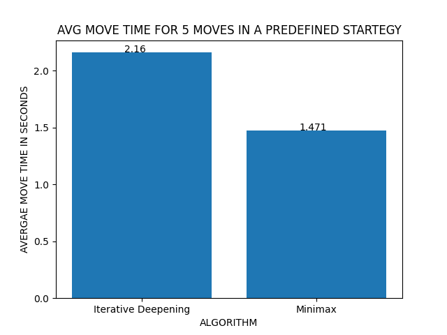
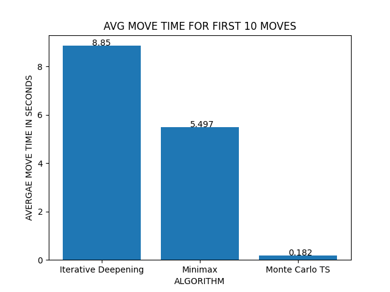

# CSC520 Artificial Intelligence Final Project
## Chess_AI_Engine_Project
Group 4 - 
* Jay Thakur
* Rohan Kausik Nandula
* Tushar Kini
* Sean Jung

Our project explores multiple adversarial techniques to create AI Agents that can play chess!

## Project Setup Instructions
* Clone the repo
* Navigate the directory structure and reach inside the folder.
* Execute the following and the game UI will open and will allow player to play game
  ```
  python main_app.py
  ```
* To compute the 1st metric and save the play times to a file in the `metrics` directory, use-
  ```
  python metric_app.py
  ```
* To compute the 2nd metric used saved strategies in the `sample_games` directory and save the play times to a file in the `metrics` directory, usethe following. New games can be added here saving them as `game3.txt`, `game4.txt` and so on.
  ```
  python sample_game.py
  ```
* To compute figures and plots for inference use the `baseline_plot.py` and `plot.py` files and excecute them using-
  ```
  python plot.py
  ```

## Metrics used
Two metrics are devised that would be helpful to gauge and compare the performance of the 3 algorithms discussed above.
* It is assumed that the player is playing randomly and then we calculate the average time taken for the computer to generate the first 10/20 moves for each random move by the player. This introduces randomness which eliminates the possibility of algorithms working better with some game plays/ narrower search space.
* There are certain strategies/ opening moves for players to gain advantage over the opponent. We make the user play a fixed set of moves and calculate the average time taken for the algorithm to compute its move.


## Results
To compare the baselines with each other we use the 2nd metric and plot the average times as follows-



Using the 1st metric defined above to compare all the 3 algorithms. We calculate the average time per move for the first 10 and 20 moves for random play by the player and plot them.




